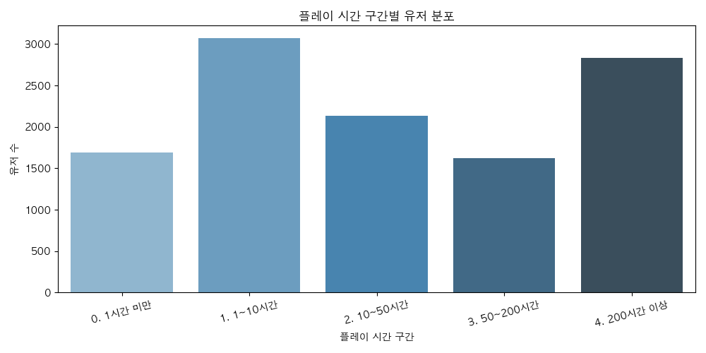
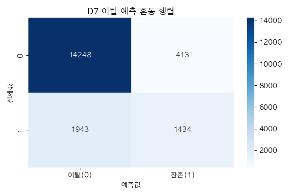

<h2> [ week 1 목표 ] </h2>

- 목적: Cookie Cats A/B 테스트 데이터로 게이트 위치(30 vs 40)에 따른 D1/D7 잔존률 차이 분석
- 데이터: kaggle.com/datasets/mursideyarkin/mobile-games-ab-testing-cookie-cats
- 서브쿼리 → CTE 리팩터링    ( ✅ Cookie Cats로 완료 )
- 퍼널 쿼리 작성    ( ✅ Cookie Cats로 완료 )

---

<h2> [ week 2 목표 ] </h2>

- 목적: Steam 게임 데이터로 구매→플레이 전환율 및 플레이 시간 구간별 유저 분포 분석
- 데이터: kaggle.com/datasets/tamber/steam-video-games
- 구매→플레이 퍼널 분석    ( ✅ Steam 데이터로 완료 )
- 플레이 시간 구간별 유저 세그먼트    ( ✅ Steam 데이터로 완료 )
- 게임별 평균 플레이 시간 Top 10    ( ✅ Steam 데이터로 완료 )
- 시각화 및 이미지 저장    ( ✅ steam_funnel.png 완료 )

### 플레이 시간 구간별 유저 분포

---

<h2> [ week 3 목표 ] </h2>

- 목적: Cookie Cats A/B 테스트 통계적 유의성 검정
- 데이터: Cookie Cats (week1과 동일)
- D1 잔존률 카이제곱 검정    ( ✅ 완료 )
- D7 잔존률 카이제곱 검정    ( ✅ 완료 )
- 결론 및 액션 아이템 도출    ( ✅ 완료 )

---

<h2> [ week 4 목표 ] </h2>

- 목적: D7 이탈 예측 모델 구현 및 Snowflake 환경 실습
- 데이터: Cookie Cats (week1과 동일)
- D7 이탈 예측 로지스틱 회귀    ( ✅ 완료 )
- 변수 중요도 분석 및 인사이트 도출    ( ✅ 완료 )
- Snowflake 계정 생성 + CSV 적재 + 쿼리 실습    ( ✅ 완료 )

### D7 이탈 예측 혼동 행렬

