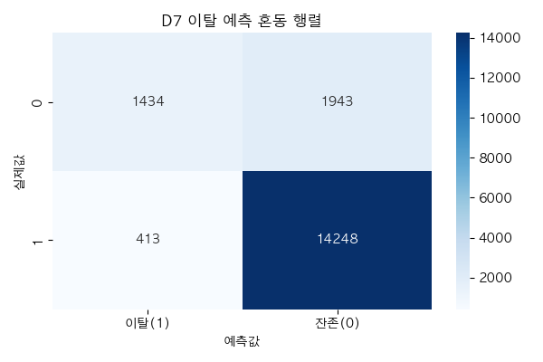
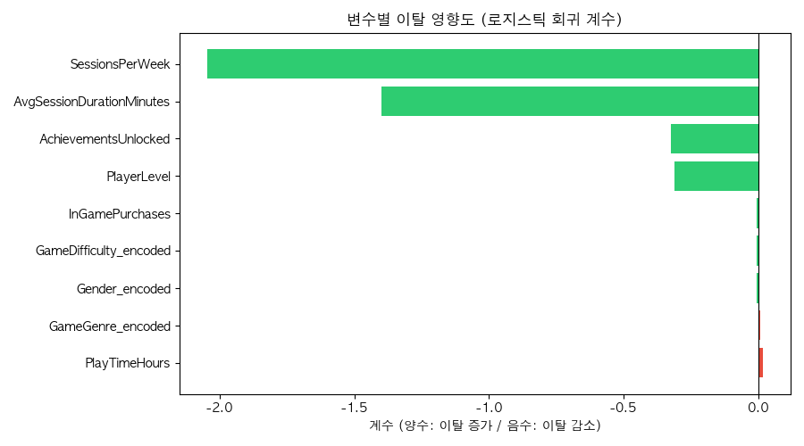
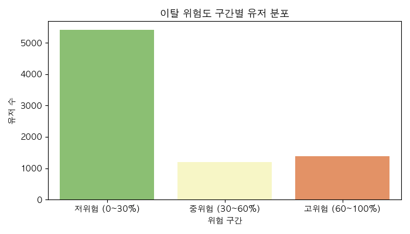

# 게임 데이터 분석 포트폴리오

**기술 스택**

| 섹션 | 주요 내용 | 데이터 |
|------|----------|--------|
| 1_SQL | 퍼널 분석 · CTE · Window 함수 | Cookie Cats |
| 2_Python | 게임 데이터 탐색 · 퍼널 시각화 | Steam |
| 3_Statistics | A/B 테스트 카이제곱 검정 | Cookie Cats |
| 4_ML | 이탈 예측 로지스틱 회귀 | Cookie Cats |
| 5_Project | 게임 유저 이탈 분석 (메인) | Online Gaming |

---

<h2>1_SQL [ 퍼널 분석 · CTE · Window 함수 ]</h2>

- 목적: Cookie Cats A/B 테스트 데이터로 게이트 버전(30 vs 40)에 따른
        D1/D7 잔존률 차이 분석
- 데이터: kaggle.com/datasets/mursideyarkin/mobile-games-ab-testing-cookie-cats

**(1) D1, D7 잔존률 서브쿼리 → CTE 리팩터링**
- D1: 플레이어가 설치 후 1일째에 다시 게임을 플레이했는지 여부
- D7: 플레이어가 설치 후 7일째에 다시 게임을 플레이했는지 여부 

  

**(2) 라운드 구간별 이탈률 퍼널 쿼리 작성**  

**(3) 게이트 버전별 라운드 수 상위 10% 유저 찾기**
- 게이트 30버전

  

- 게이트 40버전

---

<h2>2_Python [ 게임 데이터 탐색 · 퍼널 시각화 ]</h2>

- 목적: Steam 게임 데이터로 구매→플레이 전환율 및
        플레이 시간 구간별 유저 분포 분석
- 데이터: kaggle.com/datasets/tamber/steam-video-games

**(1) 구매→플레이 퍼널 분석**  

  

**(2) 게임별 평균 플레이 시간 TOP 10**  

  

**(3) 플레이 시간 구간별 세그먼트**  

  

**(4) 플레이 시간 구간별 유저 분포 시각화**  

---

<h2>3_Statistics [ A/B 테스트 유의성 검정 ]</h2>

- 목적: Cookie Cats A/B 테스트 통계적 유의성 검정
- 데이터: Cookie Cats (SQL 실습과 동일)

**(1) D1 잔존률 카이제곱 검정**  

**(2) D7 잔존률 카이제곱 검정**  

**(3) 결론 및 인사이트**  

---

<h2>4_ML [ 이탈 예측 · Snowflake 환경 실습 ]</h2>

- 목적: D7 이탈 예측 모델 구현 및 Snowflake 환경 실습
- 데이터: Cookie Cats

**(1) D7 이탈 예측 로지스틱 회귀** 
- 이슈: 어떤 유저가 D7에 이탈할 것인가?
- 타겟 변수(y): D7 잔존 여부 (1=잔존, 0=이탈)
- 독립 변수(X): version(Gate 30/40그룹), sum_gamerounds(플레이 라운드 수), D1 잔존 여부

**(2) 변수 중요도 분석 및 인사이트 도출**  
 

**(3) Snowflake CSV 적재 + 쿼리 실습**   

<h2>Tableau [ 시각화 Tableau 대시보드 구축 ]</h2>

- 목적: Cookie Cats A/B 테스트 결과 Tableau 대시보드 시각화
- 데이터: Cookie Cats (SQL 실습과 동일)
- A/B 그룹별 D1·D7 잔존률 막대차트
- 플레이 구간별 유저 분포 퍼널차트
- 버전별 평균 플레이 라운드 막대차트
- Tableau Public 대시보드 게시

🔗 [Tableau 대시보드 보기](https://public.tableau.com/views/cookie_cats_abtest_analysis_17784089744060/CookieCatsAB?:language=ko-KR&:sid=&:redirect=auth&:display_count=n&:origin=viz_share_link)

--- 

<h2>5_Project [ 게임 유저 이탈 분석 ]</h2>

- 목적: MMORPG 유저 행동 데이터 기반 이탈 요인 분석 및 세그먼트 도출
- 데이터: Kaggle Online Gaming Behavior Dataset (40,034명)
- 분석 설계서 + 7개 가설 수립
- EDA · 이탈/잔존 비교
- 로지스틱 회귀 이탈 예측 모델
- 이탈 위험 세그먼트 정의
- 액션 아이템 도출

### 변수별 이탈 영향도

**[ 로지스틱 회귀 분석 결과 ]**

**[ 통계적으로 유의미한 변수 (p-value < 0.05) ]**

| 순위 | 변수 | 계수 | 해석 |
|------|------|------|------|
| 1 | SessionsPerWeek | -2.054 | 접속 빈도 높을수록 이탈 감소 |
| 2 | AvgSessionDurationMinutes | -1.378 | 세션 길수록 이탈 감소 |
| 3 | AchievementsUnlocked | -0.319 | 업적 많을수록 이탈 감소 |
| 4 | PlayerLevel | -0.300 | 레벨 높을수록 이탈 감소 |

### 이탈 위험도 구간별 유저 분포

### 이탈 분석 Tableau 대시보드

🔗 [대시보드 보기](https://public.tableau.com/views/game_user_churn_analysis/sheet4?:language=ko-KR&:sid=&:redirect=auth&:display_count=n&:origin=viz_share_link)

💡 **핵심 결론:**
- 이탈을 결정하는 건 플레이 시간이 아닌 접속 빈도.
- 주 2회 이하 접속 유저 이탈률 84.4% vs 주 7회 이상 10.4% (8배 차이)
